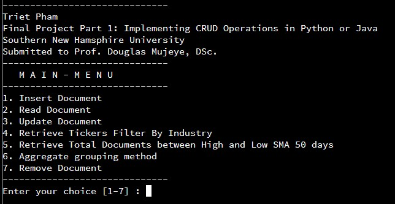

  

<h3 align="center">CS 499 Final Project ePortfolio </h3>

  A Live working Example Application of Python, Qt, PySide2, MongoDB, PyMongo, QTableView, QAbstractTableModel

  Triet Pham.

  Submitted to Prof. Satish Penmatsa
  
## Table of contents
- [Status](#status)
- [Introduction](#Introduction)
- [Informal Code Review](#Informal-Code-Review)
- [Artifact(s)](#Artifact(s))
- [Naratives](#Naratives)
- [Professional Self-Assessment](#Professional-Self-Assessment)
- [Versioning](#versioning)
- [Copyright and license](#copyright-and-license)

## Status
- [x] Code Review
- [x] Enhancement Narrative I
- [x] Enhancement Narrative II
- [x] Enhancement Narrative III
- [x] Professional Self-Assessment

## Introduction

### What is this application ?
This is a python application to load mongodb database data in pyside2 interface

### Requirements
* Python3.6
* pip install pymongo==3.7.2 - MongoDB Python Driver
* MongoDB 4.0.4 - Database Server
* (Optional)MongoDB Compass 1.16.3 - To view database

### What MongoDB Operation covered in this application
1. Connect to MongoDB database
2. Create new database
3. Create new collection
4. Insert new data
5. Update existing data
6. Query Data
7. Remove Data
8. Store image on MongoDb Database

### What is the core logics related to PySide2
1. Create a TableView
2. Create a QAbstractTableModel
3. Load MongoDB Database data in QAbstractTableModel
4. Make QAbstractTableModel rows inline editable to edit database
5. Create (Add Row, Remove Row) context Menu on Tableview
6. Create Dynamic Headers in QAbstractTableModel
7. Add New Empty Row in QAbstractTableModel
8. Remove row from QAbstractTableModel
9. Edit Cell value in QAbstractTableModel

## Informal Code Review

## Artifact(s)
#### Migrating to Pyside And QTable
##### a. Software Design and Engineering
  In this section, I will choose to enhance software design. For the artifact, I will reuse the source code I have created for my last term final project, which crate and modified the built in stock market database by using MongoDB.  However, the last term final project just ends with pure Python code, which has no software design implement. Therefore, I want to create the final program which will enhance on software design and support user interface
  

    
  

## Naratives

## Bugs and feature requests

## Professional Self-Assessment

Have a bug or a feature request? Please first read the [issue guidelines](https://github.com/twbs/bootstrap/blob/master/.github/CONTRIBUTING.md#using-the-issue-tracker) and search for existing and closed issues. If your problem or idea is not addressed yet, [please open a new issue](https://github.com/twbs/bootstrap/issues/new).

## Documentation

Bootstrap's documentation, included in this repo in the root directory, is built with [Hugo](https://gohugo.io/) and publicly hosted on GitHub Pages at <https://getbootstrap.com/>. The docs may also be run locally.

Documentation search is powered by [Algolia's DocSearch](https://community.algolia.com/docsearch/). Working on our search? Be sure to set `debug: true` in `site/assets/js/src/search.js` file.

### Running documentation locally

1. Run `npm install` to install the Node.js dependencies, including Hugo (the site builder).
2. Run `npm run test` (or a specific npm script) to rebuild distributed CSS and JavaScript files, as well as our docs assets.
3. From the root `/bootstrap` directory, run `npm run docs-serve` in the command line.
4. Open `http://localhost:9001/` in your browser, and voilà.

Learn more about using Hugo by reading its [documentation](https://gohugo.io/documentation/).

### Documentation for previous releases

You can find all our previous releases docs on <https://getbootstrap.com/docs/versions/>.

[Previous releases](https://github.com/twbs/bootstrap/releases) and their documentation are also available for download.

## Contributing

Please read through our [contributing guidelines](https://github.com/twbs/bootstrap/blob/master/.github/CONTRIBUTING.md). Included are directions for opening issues, coding standards, and notes on development.

Moreover, if your pull request contains JavaScript patches or features, you must include [relevant unit tests](https://github.com/twbs/bootstrap/tree/master/js/tests). All HTML and CSS should conform to the [Code Guide](https://github.com/mdo/code-guide), maintained by [Mark Otto](https://github.com/mdo).

Editor preferences are available in the [editor config](https://github.com/twbs/bootstrap/blob/master/.editorconfig) for easy use in common text editors. Read more and download plugins at <https://editorconfig.org/>.

## Community

Get updates on Bootstrap's development and chat with the project maintainers and community members.

- Follow [@getbootstrap on Twitter](https://twitter.com/getbootstrap).
- Read and subscribe to [The Official Bootstrap Blog](https://blog.getbootstrap.com/).
- Join [the official Slack room](https://bootstrap-slack.herokuapp.com/).
- Chat with fellow Bootstrappers in IRC. On the `irc.freenode.net` server, in the `##bootstrap` channel.
- Implementation help may be found at Stack Overflow (tagged [`bootstrap-4`](https://stackoverflow.com/questions/tagged/bootstrap-4)).
- Developers should use the keyword `bootstrap` on packages which modify or add to the functionality of Bootstrap when distributing through [npm](https://www.npmjs.com/browse/keyword/bootstrap) or similar delivery mechanisms for maximum discoverability.

## Versioning

For transparency into our release cycle and in striving to maintain backward compatibility, Bootstrap is maintained under [the Semantic Versioning guidelines](https://semver.org/). Sometimes we screw up, but we adhere to those rules whenever possible.

See [the Releases section of our GitHub project](https://github.com/twbs/bootstrap/releases) for changelogs for each release version of Bootstrap. Release announcement posts on [the official Bootstrap blog](https://blog.getbootstrap.com/) contain summaries of the most noteworthy changes made in each release.

## Creators

**Mark Otto**

- <https://twitter.com/mdo>
- <https://github.com/mdo>

**Jacob Thornton**

- <https://twitter.com/fat>
- <https://github.com/fat>

## Thanks

Thanks to [BrowserStack](https://www.browserstack.com/) for providing the infrastructure that allows us to test in real browsers!

## Sponsors

Support this project by becoming a sponsor. Your logo will show up here with a link to your website. [[Become a sponsor](https://opencollective.com/bootstrap#sponsor)]

## Backers

Thank you to all our backers! 🙏 [[Become a backer](https://opencollective.com/bootstrap#backer)]

## Copyright and license

Code and documentation copyright 2011-2020 the [Bootstrap Authors](https://github.com/twbs/bootstrap/graphs/contributors) and [Twitter, Inc.](https://twitter.com) Code released under the [MIT License](https://github.com/twbs/bootstrap/blob/master/LICENSE). Docs released under [Creative Commons](https://creativecommons.org/licenses/by/3.0/).
