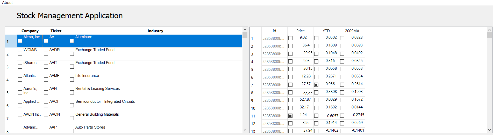

  

<h3 align="center">CS 499 Final Project ePortfolio </h3>

  A Live working Example Application of Python, Qt, PySide2, MongoDB, PyMongo, QTableView, QAbstractTableModel

  Triet Pham.

  Submitted to Prof. Satish Penmatsa

  
## Table of contents
- [Professional Self-Assessment](#Professional-Self-Assessment)
- [Status](#status)
- [Introduction](#Introduction)
- [Informal Code Review](#Informal-Code-Review)
- [Artifact(s)](#Artifact(s))
- [Naratives](#Naratives)
- [Versioning](#versioning)
- [Creators](#Creators)

## Status
- [x] Code Review
- [x] Enhancement Narrative I
- [x] Enhancement Narrative II
- [x] Enhancement Narrative III
- [x] Professional Self-Assessment

## Professional Self-Assessment
  * Hello My name is Triet Pham. I live in Worcester - a small town near Boston Massachusetts. For more of my information, please go to **Creators** and view my LinkedLink profile. Thank you for landing your foot to 
  * This project is a requirement in order to finish CS-499-Q4508 Computer Science Capstone 20EW4, which is a part of Computer Science Major in Southern New Hamsphire University. The project is a front end- back end progame, which the front ent is a Graphic User Interface that shows stock data. Besides, the back end is the entire database with Json data structure. In addition, the backend is coded with Python and Pymongo library. On the other hand, the front end is enhanced by using Pyside 
  * This project also shows my strength in computer science skill, specificly in database manipulation and Python Programming langue. By doing and completing this project, I am albo to gain a huge amount of knowlege about designing and making UI through Python Language. As a result, this project will strengthen my **Software Design and Engineering** skill. It also helps me to be prapared for future carrer, when Information Technology and Big Data is getting more population. For example, by creating the UI with multiple tables, which I have to perform alot of software designing skills. Then performing CRUD( Create, Read, Update, Delete) in the backend by using MongoDB and Python programming language also shows my programming 
   * In this project, the backend and the frontend are in the master-slave relationtinship. At first, the backend will use Pyside and QtCore in order to create the blank tables. Then it will execute fuctions in order to show the stock data in all tables. However, the frontend also recive inputs from users then send those inputs to backend. The backend will exceute fucntions based on those inputs and output the results back to the frontend

## Introduction

### What is this application ?
This is a python application to load mongodb database data in pyside2 interface

### Requirements
* Python3.6
* pip install pymongo==3.7.2 - MongoDB Python Driver
* MongoDB 4.0.4 - Database Server
* (Optional)MongoDB Compass 1.16.3 - To view database

### What MongoDB Operation covered in this application
1. Connect to MongoDB database
2. Create new database
3. Create new collection
4. Insert new data
5. Update existing data
6. Query Data
7. Remove Data
8. Store image on MongoDb Database

### What is the core logics related to PySide2
1. Create a TableView
2. Create a QAbstractTableModel
3. Load MongoDB Database data in QAbstractTableModel
4. Make QAbstractTableModel rows inline editable to edit database
5. Create (Add Row, Remove Row) context Menu on Tableview
6. Create Dynamic Headers in QAbstractTableModel
7. Add New Empty Row in QAbstractTableModel
8. Remove row from QAbstractTableModel
9. Edit Cell value in QAbstractTableModel

## Informal Code Review
[Link to Code Review Video (YouTube)](https://youtu.be/A4SSjBSesTw)

## Artifact(s)
#### Migrating to Pyside And QTable
##### a. Software Design and Engineering (CS 340: Advanced Programming Concepts)
  In this section, I will choose to enhance software design. For the artifact, I will reuse the source code I have created for my last term final project, which crate and modified the built in stock market database by using MongoDB.  However, the last term final project just ends with pure Python code, which has no software design implement. Therefore, I want to create the final program which will enhance on software design and support user interface. After researching what kind of proper library in order to create a GUI table, I have found and choose **PySide and QTable as a core libraries in order to work on designing part**

    
  </a>

<h3 align="center">Old Stock Database User Interface in Python Shell</h3>
  
  Then my first initial design was creating a one main window that shows every information of the stock database
  

    

<h3 align="center">Mockup Design for the new Application</h3>

 ### Database (CS 340: Advanced Programming Concepts)
  In the last term final project, I already had a built in database. All I needed to do that to implement CRUD to the database, which anyone can perform CRUD to the database. For the improvement for the project, I will work on how to use Python in order to perform CRUD command directly to the database by using **pymongo library**. Besides, performing CRUD in Python and exporting the results to the UI table is another enhanment in this artifact. 
  Then my first initial design was creating a one main window that shows every information of the stock database
  

    

<h3 align="center">Databse Use Case Diagram</h3>

## Naratives
### I. Software Design and Engineering
#### Description
  In order to create the GUI for the project, I have to research what kind of Python Library that fits for creating tables. As a result, I have found Pyside and QTable. Basically, those libraries that allow user to creat tables by using Python Programing Language. The artifact was found during the first week of this capstone 
### What are included
  The library I have used in order to enhance this artifact which is **Pyside and QTable**. Those librares help me to create  multiple tables and export all stock data in database to the tables. Besides that, all the CRUD perfomance will also be made directly on those tables. 
### Justify and Inclusion
#### Learning
  During the development, I am able to create multiples table that export all the data from the database. At first, my initial decision that were creating only one table (see Mockup) which was included all the stock information. However,  After multiple revisions, my final GUI which is included three different tables. The first table will show stock company, ticker and industry. The second table is for editing specific stock data. And the last table that will show the rest of the stock data.

    

<h3 align="center">First Version</h3>

    

<h3 align="center">Final Version</h3>

  Besides, I also create the pops-up window after the right click is triggered. The pops-up window will contrain the basic CRUD functions. Therefore, In order to perform CRUD, I just need to right click and choose what type of action I want to do.
  

    

<h3 align="center">CRUD pops up window</h3>

#### Challenges
  * The three tables are are to synchronize together. I have to refactor and take alot of time in order to have those tables work togetger
  * The add function take a lot of time to complete because the complication of the database. However, I sucessfully can add the new row to the databse.

### II. Database
#### Description
  This artifact was created in the last term project. It basically is the database which has all the bult-in stock information such as Ticker, Industry, Conpany, Price, etc. It was a pure database. However, during the last term, I was able to perform CRUD command then print the result directly to the command shell. The project was coded in Codio. **However, for this capstone, I want to build the Graphic User Interface Program then perform CRUD commands directly into the program**
### What are included
  The library I have used in order to enhance this artifact which is **pymongo**. The library help me to modify and manupulate data in the database by using Python Programing Language. Beisdes, I have to install **Mongo Compass** in order to connect to Mongo local sever. 
### Justify and Inclusion
#### Learning
  For this artifact, because I based on the old code that already has the CRUD built-in, hence I need to convert the old code to the new one which fit to pymongo library. As a result, during this capstone, I am able to know how to transfer and convert any Pymongo command into Pytho code. 

#### Challenges
  There is no obstacles during database development.

## Bugs and feature requests
 - Adding data does not work in table 1 and table 2, need to rework on algorithims. 
 - Tableviews will need to rework in the future for better view
 

## Documentation

Pyside's documentation, is built with [Pyside](https://srinikom.github.io/pyside-docs/PySide/QtGui/QTableWidget.html).The docs may also be run locally.

Pymongo's documentation, is built with [Pymongo](https://pymongo.readthedocs.io/en/stable/).The docs may also be run in github page. 

## Versioning

### app version:1.0.1
  #### 3.22.2020
  1. Update tableview # 2 to show stock prices, 200 days moving aveage
  2. Read, Delete and Update can be done directly on the app interface
  3.Update tableview # 2 to show stock prices, 200 days moving aveage.
  4. Read, Delete and Update can be done directly on the app interface.
  5. ADD method is till bugging
### app version 1.0.2
  #### 3.29.2020
1. Update table 3
2.Table 3 shows stock statistic data
3. Can add empty row and edit Ticker Data now
### app version 1.0.3
  #### 4.05.2020
1. Create CRUB side window
2.Fully Edit Current Cell Interactively in Tableview 3
3. Add/remove empty rownoteworthy changes made in each release.
### app version 1.0.4
  ### 4.19.2020
1. Revise table 2 to be fully eddited 
2. Rework on table 1 to make it cleaner
3. Update Readme for the final project
4. Refactor, clean code

## Creators

**Triet Pham**

- <https://www.linkedin.com/in/triet-pham-90444276/>
- <https://github.com/trietpham91>
